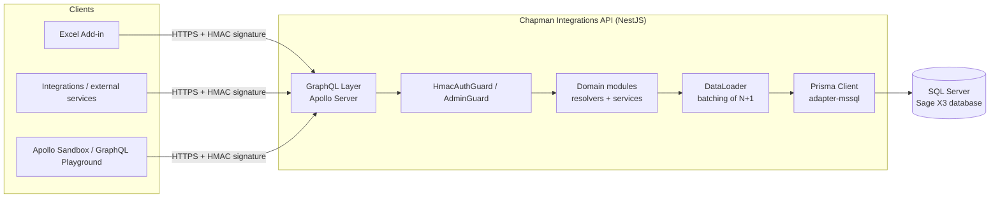

# Chapman Integrations API

GraphQL API, built with [NestJS](https://nestjs.com/), that exposes **Sage X3** ERP data to external systems (integrations, Excel add-ins, portals, and third-party services). It is the backend responsible for reading and writing directly to X3 tables, applying the required business rules before storing any information.

!!! info "About this site"
This documentation is generated with [MkDocs](https://www.mkdocs.org/) + [Material for MkDocs](https://squidfunk.github.io/mkdocs-material/) from the source code of the `api-graphql-x3-chapman` repository, and published as a static site on Cloudflare Pages.

## What the API does

- Exposes a single **GraphQL** schema (`/graphql`) with queries and mutations for the main X3 entities: customers, suppliers, products, companies, sites, sales and purchase orders, supplier invoices, accounting entries, analytical dimensions, exchange rates, payment terms, and others.
- Connects **directly to the X3 SQL Server database** (it does not use the native X3 web services), through [Prisma ORM](https://www.prisma.io/) with the `@prisma/adapter-mssql` adapter.
- Authenticates each request using a custom **HMAC** signature (does not use OAuth/JWT), designed for server-to-server integrations and the Chapman Excel add-in.
- Also serves the static files for the **Excel add-in** under `/addin`.

## Architecture



**Main components:**

| Layer                   | Responsibility                                                                                                                             | Location                                |
| ----------------------- | ------------------------------------------------------------------------------------------------------------------------------------------ | --------------------------------------- |
| GraphQL layer           | Exposes the `/graphql` endpoint through Apollo Server, generates the schema (`src/schema.gql`) automatically from resolvers (`code-first`) | `src/app.module.ts`                     |
| Authentication          | Validates the HMAC signature on each request (`HmacAuthGuard`) and the administration key (`AdminGuard`) for internal operations           | `src/modules/auth`, `src/common/guards` |
| Domain modules          | One NestJS module per business entity (resolver + service + GraphQL DTOs/entities)                                                         | `src/modules/*`                         |
| DataLoader              | Groups and caches reads per request, avoiding the N+1 problem when resolving related fields (e.g. customer addresses)                      | `src/dataloader`                        |
| Data access             | Prisma Client connected to the X3 SQL Server through the `adapter-mssql` adapter                                                           | `src/prisma`, `src/generated/prisma`    |
| Cross-cutting utilities | Pagination (cursor/Relay), text translation, encryption/decryption, request context, X3 enums (local menus)                                | `src/common/*`                          |

## Authentication

All requests (except those marked with `@Public()`) go through `HmacAuthGuard` and require the following HTTP headers:

| Header                     | Description                                                                             |
| -------------------------- | --------------------------------------------------------------------------------------- |
| `X-App-Key`                | Client application identifier                                                           |
| `X-Client-Id`              | Client/installation identifier                                                          |
| `X-Timestamp`              | Unix timestamp (seconds) of the request                                                 |
| `X-Signature`              | HMAC-SHA256 of `appKey + clientId + timestamp`, calculated using the application secret |
| `X-Excel-Key` _(optional)_ | Marks the request as originating from the Excel add-in                                  |

The server recalculates the signature using the secret stored (encrypted) in the credentials table and compares it securely (`crypto.timingSafeEqual`). Requests with a timestamp outside the window defined by `AUTH_SIGNATURE_TTL_SECONDS` are rejected. Credentials (App Key/App Secret) are created through the `createApiCredential` mutation, described in [Configuration and utilities (common)](modules/common.md).

Internal administration operations (e.g. `getActivityCodeDimension`) instead use the `X-Admin-Key` header, validated by `AdminGuard` against the `ADMIN_API_KEY` environment variable.

## Technical stack

- **Runtime/Framework:** Node.js, NestJS 11
- **API:** GraphQL (Apollo Server 5), automatically generated _code-first_ schema
- **Database:** SQL Server (Sage X3 database), accessed through Prisma 7 + `@prisma/adapter-mssql`
- **Validation:** `class-validator` / `class-transformer`
- **Internal events:** `@nestjs/event-emitter` (e.g. sales/purchase order events)
- **Tests:** Jest

## Requirements

- Node.js (see the version pinned in [`.nvmrc`](https://github.com/joserobertoferreira/api-graphql-x3-chapman/blob/main/.nvmrc))
- Network access to the Sage X3 SQL Server instance
- A valid X3 user to generate API credentials (X3 login/password)

## Environment configuration

Copy `.env.example` to `.env` and fill in the values:

```bash
cp .env.example .env
```

| Variable                                                                    | Description                                                              |
| --------------------------------------------------------------------------- | ------------------------------------------------------------------------ |
| `DATABASE_URL`                                                              | SQL Server connection string in Prisma format (`sqlserver://...`)        |
| `DB_SERVER`, `DB_INSTANCENAME`, `DB_DATABASE`, `DB_USERNAME`, `DB_PASSWORD` | Database connection parameters (used by auxiliary scripts)               |
| `DB_SCHEMA`, `DB_AUTH_SCHEMA`                                               | SQL schemas used by business and authentication tables                   |
| `NODE_ENV`                                                                  | `development` \| `production`                                            |
| `SERVER_PORT`                                                               | HTTP port where the API is available (defaults to `3001` if not defined) |
| `AUTH_SIGNATURE_TTL_SECONDS`                                                | Validity window (seconds) for the HMAC signature                         |
| `ADMIN_API_KEY`                                                             | Key used by `AdminGuard` for administrative operations                   |

## Running locally

```bash
npm install

# generate the Prisma Client from the schema
npm run prisma:generate

# development, with automatic reload
npm run start:dev
```

The API is available at `http://localhost:3001/graphql` (or the port defined in `SERVER_PORT`), with the local Apollo Sandbox enabled for exploring the schema and testing queries/mutations.

Other useful commands:

```bash
npm run build          # compiles to dist/
npm run start:prod      # runs the production build (dist/main.js)
npm run lint             # ESLint
npm run test              # unit tests (Jest)
npm run test:e2e          # end-to-end tests
npm run prisma:migrate    # applies Prisma migrations in development
```

## API deployment (production environment)

There is currently no automated CI/CD pipeline in this repository — deployment is performed manually to the server where the integration resides. General steps:

1. `npm ci` followed by `npm run build` (generates `dist/`) and `npm run prisma:generate`.
2. Define the production environment variables (see the table above) on the target server, never in versioned files.
3. Start the application with `node dist/main.js`, kept running through a process manager (for example PM2, NSSM, or a Windows service, depending on the server operating system).
4. Place the API behind a reverse proxy (IIS, Nginx, etc.) that handles TLS and forwards requests to the port configured in `SERVER_PORT`, and ensure that the authentication headers (`X-App-Key`, `X-Client-Id`, `X-Timestamp`, `X-Signature`) are not removed by the proxy.
5. Confirm the allowed origins in `app.enableCors(...)` (`src/main.ts`) — update the list whenever a new client origin (e.g. another portal or add-in) needs to access the API.

## Deploying this documentation to Cloudflare Pages

This site is generated with MkDocs and can be published on [Cloudflare Pages](https://developers.cloudflare.com/pages/) like any other static site.

**Cloudflare Pages project configuration:**

| Setting                | Value                                                  |
| ---------------------- | ------------------------------------------------------ |
| Framework preset       | `MkDocs` (or "None")                                   |
| Build command          | `pip install -r requirements-docs.txt && mkdocs build` |
| Build output directory | `site`                                                 |
| Root directory         | `/` (repository root)                                  |

Steps:

1. In the Cloudflare dashboard, create a Pages project linked to this GitHub repository.
2. Apply the build settings from the table above.
3. Publish — each push to the production branch (e.g. `main`) automatically triggers a new build and deployment.

To test locally before publishing:

```bash
pip install -r requirements-docs.txt
mkdocs serve      # site at http://127.0.0.1:8000 with live-reload
mkdocs build      # generates the site/ directory (the same output used by Cloudflare Pages)
```

## Module structure

Each X3 business entity is implemented as an independent NestJS module under `src/modules/<name>`, following the same pattern: `*.module.ts`, `*.resolver.ts`, `*.service.ts`, `dto/` (inputs), and `entities/` (GraphQL output types). See the **Modules** section in the sidebar for the detailed description of each one, including the available queries and mutations.

## Pagination

Lists (`getCustomers`, `getSuppliers`, `getSalesOrders`, etc.) follow the cursor-based pagination pattern in the [Relay](https://relay.dev/graphql/connections.htm) style:

```graphql
query {
  getCustomers(first: 10, after: "<cursor>", filter: { ... }) {
    edges {
      cursor
      node { customerCode name }
    }
    pageInfo {
      hasNextPage
      endCursor
    }
    totalCount
  }
}
```

- `first`: number of items to return (defaults to `10`).
- `after`: cursor returned in `pageInfo.endCursor` from the previous page.
- `totalCount` is only calculated when explicitly requested in the query (performance optimization).
