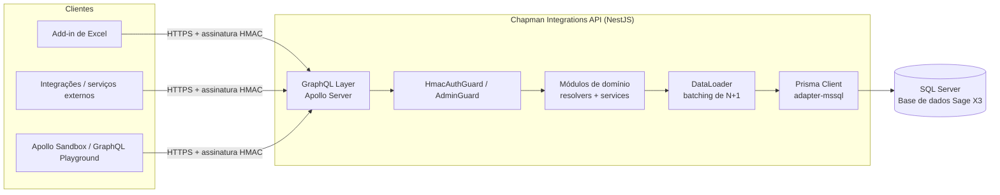

# Chapman Integrations API

API GraphQL, construída em [NestJS](https://nestjs.com/), que expõe os dados do ERP **Sage X3** para sistemas externos (integrações, add-ins de Excel, portais e serviços de terceiros). É o backend responsável por ler e escrever diretamente nas tabelas do X3, aplicando as regras de negócio necessárias antes de gravar qualquer informação.

!!! info "Sobre este site"
Esta documentação é gerada com [MkDocs](https://www.mkdocs.org/) + [Material for MkDocs](https://squidfunk.github.io/mkdocs-material/) a partir do código-fonte do repositório `api-graphql-x3-chapman`, e é publicada como site estático no Cloudflare Pages.

## O que a API faz

- Expõe um schema **GraphQL** único (`/graphql`) com queries e mutations para as principais entidades do X3: clientes, fornecedores, produtos, empresas, estabelecimentos, encomendas de venda e de compra, faturas de fornecedor, lançamentos contabilísticos, dimensões analíticas, taxas de câmbio, condições de pagamento, entre outras.
- Liga-se **diretamente à base de dados SQL Server** do X3 (não usa os web services nativos do X3), através do [Prisma ORM](https://www.prisma.io/) com o adaptador `@prisma/adapter-mssql`.
- Autentica cada pedido com uma assinatura **HMAC** própria (não usa OAuth/JWT), pensada para integrações servidor-a-servidor e para o add-in de Excel da Chapman.
- Serve também os ficheiros estáticos do **add-in de Excel** em `/addin`.

## Arquitetura



**Principais blocos:**

| Camada                   | Responsabilidade                                                                                                                      | Localização                             |
| ------------------------ | ------------------------------------------------------------------------------------------------------------------------------------- | --------------------------------------- |
| GraphQL layer            | Expõe o endpoint `/graphql` via Apollo Server, gera o schema (`src/schema.gql`) automaticamente a partir dos resolvers (`code-first`) | `src/app.module.ts`                     |
| Autenticação             | Valida a assinatura HMAC em cada pedido (`HmacAuthGuard`) e a chave de administração (`AdminGuard`) para operações internas           | `src/modules/auth`, `src/common/guards` |
| Módulos de domínio       | Um módulo NestJS por entidade de negócio (resolver + service + DTOs + entidades GraphQL)                                              | `src/modules/*`                         |
| DataLoader               | Agrupa e faz cache de leituras por pedido, evitando o problema N+1 ao resolver campos relacionados (ex.: endereços de um cliente)     | `src/dataloader`                        |
| Acesso a dados           | Prisma Client, ligado ao SQL Server do X3 através do adaptador `adapter-mssql`                                                        | `src/prisma`, `src/generated/prisma`    |
| Utilitários transversais | Paginação (cursor/Relay), tradução de textos, encriptação/decifragem, contexto do pedido, enums do X3 (local menus)                   | `src/common/*`                          |

## Autenticação

Todos os pedidos (exceto os marcados com `@Public()`) passam pelo `HmacAuthGuard` e precisam dos seguintes cabeçalhos HTTP:

| Cabeçalho                  | Descrição                                                                            |
| -------------------------- | ------------------------------------------------------------------------------------ |
| `X-App-Key`                | Identificador da aplicação cliente                                                   |
| `X-Client-Id`              | Identificador do cliente/instalação                                                  |
| `X-Timestamp`              | Timestamp Unix (segundos) do pedido                                                  |
| `X-Signature`              | HMAC-SHA256 de `appKey + clientId + timestamp`, calculado com o segredo da aplicação |
| `X-Excel-Key` _(opcional)_ | Marca o pedido como originado no add-in de Excel                                     |

O servidor recalcula a assinatura com o segredo guardado (encriptado) na tabela de credenciais e compara-a de forma segura (`crypto.timingSafeEqual`). Pedidos com timestamp fora da janela definida em `AUTH_SIGNATURE_TTL_SECONDS` são rejeitados. As credenciais (App Key/App Secret) são criadas através da mutation `createApiCredential`, descrita em [Configuração e utilitários (common)](modules/common.pt.md).

Operações internas de administração (ex.: `getActivityCodeDimension`) usam em alternativa o cabeçalho `X-Admin-Key`, validado pelo `AdminGuard` contra a variável `ADMIN_API_KEY`.

## Stack técnica

- **Runtime/Framework:** Node.js, NestJS 11
- **API:** GraphQL (Apollo Server 5), schema _code-first_ gerado automaticamente
- **Base de dados:** SQL Server (base de dados do Sage X3), acedida via Prisma 7 + `@prisma/adapter-mssql`
- **Validação:** `class-validator` / `class-transformer`
- **Eventos internos:** `@nestjs/event-emitter` (ex.: eventos de encomendas de venda/compra)
- **Testes:** Jest

## Requisitos

- Node.js (ver versão fixada em [`.nvmrc`](https://github.com/joserobertoferreira/api-graphql-x3-chapman/blob/main/.nvmrc))
- Acesso de rede à instância SQL Server do Sage X3
- Um utilizador X3 válido para gerar credenciais de API (login/password X3)

## Configuração do ambiente

Copie `.env.example` para `.env` e preencha os valores:

```bash
cp .env.example .env
```

| Variável                                                                    | Descrição                                                                  |
| --------------------------------------------------------------------------- | -------------------------------------------------------------------------- |
| `DATABASE_URL`                                                              | Connection string do SQL Server no formato Prisma (`sqlserver://...`)      |
| `DB_SERVER`, `DB_INSTANCENAME`, `DB_DATABASE`, `DB_USERNAME`, `DB_PASSWORD` | Parâmetros de ligação à base de dados (usados por scripts auxiliares)      |
| `DB_SCHEMA`, `DB_AUTH_SCHEMA`                                               | Schemas SQL usados pelas tabelas de negócio e de autenticação              |
| `NODE_ENV`                                                                  | `development` \| `production`                                              |
| `SERVER_PORT`                                                               | Porta HTTP onde a API fica disponível (por omissão `3001` se não definida) |
| `AUTH_SIGNATURE_TTL_SECONDS`                                                | Janela de validade (segundos) da assinatura HMAC                           |
| `ADMIN_API_KEY`                                                             | Chave usada pelo `AdminGuard` para operações administrativas               |

## Executar localmente

```bash
npm install

# gerar o Prisma Client a partir do schema
npm run prisma:generate

# desenvolvimento, com reload automático
npm run start:dev
```

A API fica disponível em `http://localhost:3001/graphql` (ou na porta definida em `SERVER_PORT`), com o Apollo Sandbox local ativo para explorar o schema e testar queries/mutations.

Outros comandos úteis:

```bash
npm run build          # compila para dist/
npm run start:prod      # executa a build de produção (dist/main.js)
npm run lint             # ESLint
npm run test              # testes unitários (Jest)
npm run test:e2e          # testes end-to-end
npm run prisma:migrate    # aplica migrações Prisma em desenvolvimento
```

## Deploy da API (ambiente de produção)

Não existe ainda um pipeline de CI/CD automatizado neste repositório — o deploy é feito manualmente para o servidor onde reside a integração. Passos gerais:

1. `npm ci` seguido de `npm run build` (gera `dist/`) e `npm run prisma:generate`.
2. Definir as variáveis de ambiente de produção (ver tabela acima) no servidor de destino, nunca em ficheiros versionados.
3. Arrancar a aplicação com `node dist/main.js`, mantida ativa através de um gestor de processos (por exemplo PM2, NSSM ou um serviço do Windows, consoante o sistema operativo do servidor).
4. Colocar a API atrás de um proxy reverso (IIS, Nginx, etc.) que trate TLS e encaminhe os pedidos para a porta configurada em `SERVER_PORT`, e garantir que os cabeçalhos de autenticação (`X-App-Key`, `X-Client-Id`, `X-Timestamp`, `X-Signature`) não são removidos pelo proxy.
5. Confirmar as origens permitidas em `app.enableCors(...)` (`src/main.ts`) — atualizar a lista sempre que uma nova origem cliente (ex.: outro portal ou add-in) precise de aceder à API.

## Deploy desta documentação no Cloudflare Pages

Este site é gerado com MkDocs e pode ser publicado no [Cloudflare Pages](https://developers.cloudflare.com/pages/) como qualquer outro site estático.

**Configuração do projeto no Cloudflare Pages:**

| Definição              | Valor                                                  |
| ---------------------- | ------------------------------------------------------ |
| Framework preset       | `MkDocs` (ou "None")                                   |
| Build command          | `pip install -r requirements-docs.txt && mkdocs build` |
| Build output directory | `site`                                                 |
| Root directory         | `/` (raiz do repositório)                              |

Passos:

1. No dashboard do Cloudflare, criar um projeto Pages ligado a este repositório GitHub.
2. Aplicar as definições de build da tabela acima.
3. Publicar — cada push à branch de produção (ex.: `main`) despoleta automaticamente um novo build e deploy.

Para testar localmente antes de publicar:

```bash
pip install -r requirements-docs.txt
mkdocs serve      # site em http://127.0.0.1:8000 com live-reload
mkdocs build      # gera a pasta site/ (o mesmo output usado no Cloudflare Pages)
```

## Estrutura de módulos

Cada entidade de negócio do X3 é implementada como um módulo NestJS independente em `src/modules/<nome>`, seguindo o mesmo padrão: `*.module.ts`, `*.resolver.ts`, `*.service.ts`, `dto/` (inputs) e `entities/` (tipos GraphQL de saída). Consulte a secção **Módulos** no menu lateral para a descrição detalhada de cada um, incluindo as queries e mutations disponíveis.

## Paginação

As listagens (`getCustomers`, `getSuppliers`, `getSalesOrders`, etc.) seguem o padrão de paginação por cursor no estilo [Relay](https://relay.dev/graphql/connections.htm):

```graphql
query {
  getCustomers(first: 10, after: "<cursor>", filter: { ... }) {
    edges {
      cursor
      node { customerCode name }
    }
    pageInfo {
      hasNextPage
      endCursor
    }
    totalCount
  }
}
```

- `first`: número de itens a devolver (por omissão `10`).
- `after`: cursor devolvido em `pageInfo.endCursor` da página anterior.
- `totalCount` só é calculado quando pedido explicitamente na query (otimização de desempenho).
